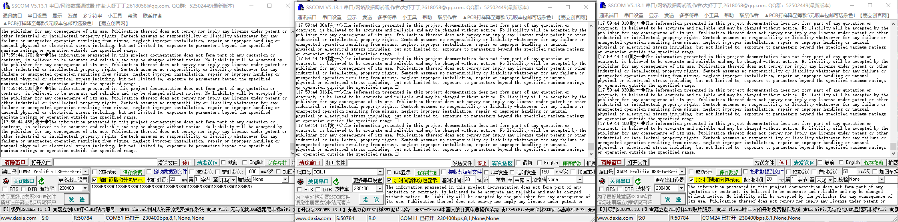

# Mogu_CC2530_lora

#### 介绍
使用CC2530基本射频实现zigbee网络搭建，使用802.15.4的协议，可以显示各个节点通过AT指令配置，自由配置节点、协调器角色，协调器通过广播发送数据，节点通过点播发送数据到协调啊，默认没有开启CCM加密

#### 软件架构
使用Ti的CC2530芯片的基本射频功能实现透传，该协议使用IEEE 802.15.4 MAC兼容数据和确认数据包。但是它没有提供一个完整的MAC层，只有一个简单的数据链路层用于两个节点之间的通信;
基本射频仅包含802.15.4标准的一小部分:
    •未实现关联、扫描或信标
    •没有定义协调器/设备角色(对等，所有节点都是相等的)
    •没有数据包重传。这必须由基本RF上层来处理;
关于CC2530基本射频API详见文档docs/CC2530_Software_Examples.pdf

#### 性能介绍
在波特率230400的情况下，一次发送2048byte字节数据，从发送时开始计时，250ms之后发送下一次数据，连续发送不会造成丢包；经过测试，波特率较时会造成丢包，可以修改源码中的射频分包发送过程中的间隔时间；

#### 源码使用

1.  使用IAR for 8051 打开ide/mogulinker/iar/Mogu.eww
2.  直接使用CC DEBUGGER进行烧写
3.  xxxx

#### 模组使用

1.  使用AT指令进行操作，默认波特率115200
    关于使用的文档详见文档docs/CC2530配置文档.docx

#### 参与贡献

